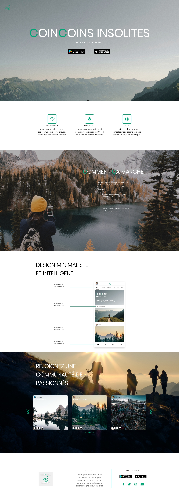
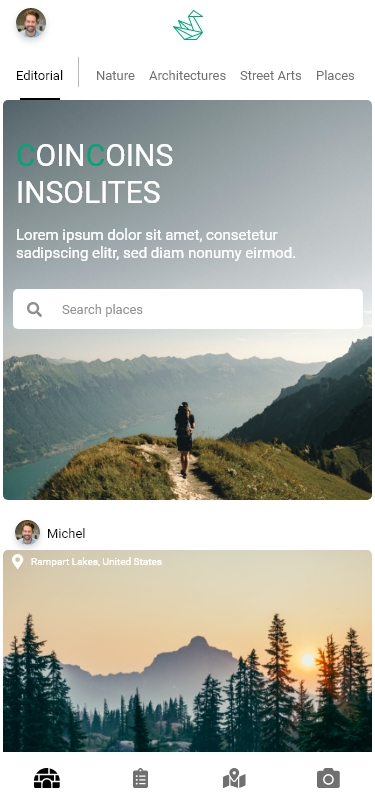
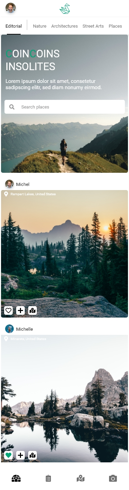
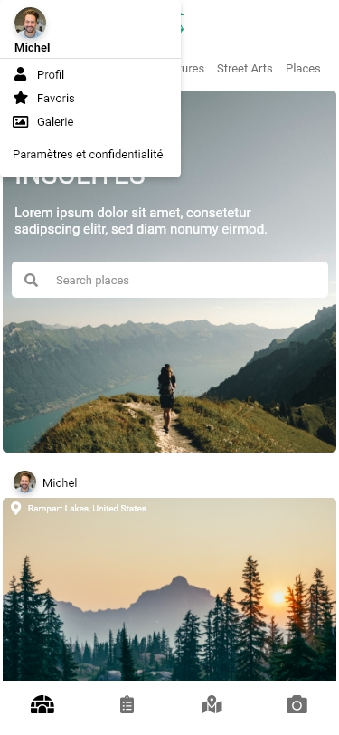
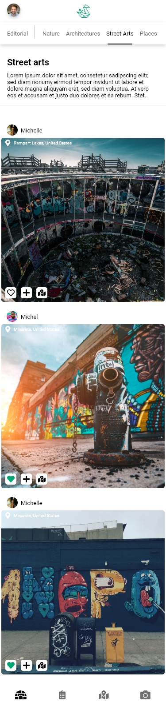

# Présentation

## Dépôts :

* [Le site internet et l'API](https://github.com/PaixHaine/WebsiteCA)
* [L'application mobile](https://github.com/PaixHaine/CoinCoins-Insolites)

## Le projet

CoinCoins Insolites est une jeune startup qui souhaite offrir une nouvelle expérience au monde
de la randonnée. Rien qu’en France, les randonneurs seraient plus de 18 millions. Et selon des
recherches effectuées par CoinCoins Insolites, l’intérêt est grandissant chaque année.

En analysant les données sur les 5 dernières années, on remarque une forme de saisonnalité
avec un pique régulier en juillet/aout, et ce toujours en concevant une tendance à la hausse.

CoinCoins Insolites souhaite profiter de cette opportunité pour développer une application
mobile indiquant aux utilisateurs des coins insolites à voir sur des parcours de randonnées.
Nous ne souhaitons pas créer une application concurrente des outils proposant des parcours de
randonnées, mais utiliser le levier pour offrir à nos utilisateurs des coins insolites à visiter.
La startup souhaite mettre en place une communication insolite pour l’occasion, et ce par
l’intermédiaire de son futur site Web.

### Nom du projet
CoinCoins Insolites : DES LIEUX À VOUS CLOUEZ LE BEC.

## [Maquettes](https://github.com/PaixHaine/WebsiteCA/tree/develop/docs/design)

### [Le site internet](https://github.com/PaixHaine/WebsiteCA) :
|  |
| ----------- |

### [L'application mobile](https://github.com/PaixHaine/CoinCoins-Insolites) :
|  |  |  |  |
| ----------- | ----------- | ----------- | ----------- |

## L'équipe

### [Baptiste Bouriau](https://fr.linkedin.com/in/baptiste-bouriau-3a675b16b)
#### Tâches :
* Réaliser les maquettes;
* Concevoir et développer le site internet;
* Concevoir et développer l'API.

### [Pierre-Nicolas ZINSOU](https://www.linkedin.com/in/pierre-nicolas-zinsou/)
#### Tâches :
* Développer le front de l'application mobile

### [Ewen BALOUIN](https://www.linkedin.com/in/ewen-b-38269113b/)
#### Tâches :
* Développer les différentes fonctionnalités de l'application.

### [Lucas DURAND](https://www.linkedin.com/in/lucas-durand-771923166/)
#### Tâches :
* Développer les différentes fonctionnalités de l'application.

## Retour sur l'activité de l'équipe

### Pierre-Nicolas
Concernant le développement de l'application, je me suis occupé de toute la partie front-end de la page du fil d'actualités.
Je me suis basé sur un template déjà existant et j'ai modifié et agencé le design en fonction de nos besoins et de la maquette que l'on avait réalisé au préalable.
J'ai donc principalement développé en web (html, scss, ts) et je n'ai pas trop touché à la partie back-end du dev. Actuellement je suis sur le développement de la fonctionnalité de profil, pouvoir avoir accès au profil d'un utilisateur.
Après il me restera l'intégration du module photo pour pouvoir prendre des photos directement dans l'application ainsi que la possibilité de laisser un "j'aime" et pourquoi pas des commentaires sous chaque post.

### Ewen
L’application que nous avons réalisés est faite sur le framework Ionic avec angular. Je me suis principalement occupé de la partie fonctionnelle de l’application. J’ai réalisé la page d’accueil. Elle est constitué d’une barre de recherche connecté à l’api des municipalités de l’État (https://api-adresse.data.gouv.fr/search?q=paris&type=municipality).
Grâce à ces données, j’ai sorti les villes en fonction de ce qu'écrivait l’utilisateur en temps réel et ainsi récupérer les coordonnées de la ville pour récupérer les lieux à proximité. Puis avec Lucas Durand, nous avons réalisés une page intégrant une librairie externe opensource LeafletJs. Cette librairie permet d’avoir une carte intéractive et paramétrable. Nous nous sommes servi pour afficher les lieux par des points sur la carte par rapport au lieu à proximité de la ville que l’utilisateur a recherché précédemment. Mais nous étions censé mettre en place une API sur notre back-office afin de pouvoir récupérer les lieux à proximité de la ville. Notre souhait était d'externaliser nos calculs sur notre Back-office afin d'alléger notre application au maximum, mais nous n’avons pas pu mettre en place. J’ai commencé à réaliser un système de photo qui permet d’envoyer une photo géolocalisé de lieux insolites sur notre base de données pour que les utilisateurs puissent ajouter eux-même du contenu.

### Lucas
Pour ma part, j'ai d'abord proposé une première maquette pour l'application mobile, mais cette dernière a évolué avec le temps et Baptiste l’a retravaillé par la suite. Ensuite, après avoir établi les différentes features à réaliser, nous nous sommes penchés avec Ewen sur une map interactive open source, nous voulions dans un premier temps partir sur celle de Google mais cette dernière est malheureusement payante. Nous nous sommes donc penchés sur une autre map qui se prénomme Leaflet ( https://leafletjs.com/ ). Ainsi, nous avons tenté de lui ajouter des fonctionnalités telles que le zoom, des marqueurs ou encore la géolocalisation. Ainsi, nous avons rencontré un problème du chargement de la map, en effet celle-ci ne chargeait pas entièrement et nous comprenions par d'où le problème pouvait venir. Pour finir, je pense que ce projet m’a permis d'approfondir mes connaissances sur le framework Ionic que j’avais déjà utilisé au cours d’un autre projet auparavant. De plus, j’ai également pu en apprendre plus sur certaines fonctionnalités effectuées par mes camarades (comme les API des municipalités ou encore la mise en place d’un appareil photo intégré à l’application).

### Baptiste
Dans ce projet j'ai pu être multifonction. J'ai commencé par réfléchir à une charte graphique afin de créer une identité au projet. Une fois la charte graphique réalisé, j'ai pu concevoir une maquette pour le site internet et une maquette pour l'application. Après s'être mis d'accord sur les maquettes, je me suis attaqué au site internet. En premier lieu j'ai développer le front de la home page. Suite à ça j'ai développé un peu de back (enregistrement de faux postes en base de donnée avec des fixtures). Une fois la base de donnée initialisée avec de la fausse donnée, j'ai pu travailler sur un carrousel d'images des derniers postes sur la home page. Une fois la carousel fonctionnel et responsive, j'ai travaillé sur la gallery page. Aujourd'hui il me reste des finitions à apporter sur la gallery page, le responsive est à retravailler pour certaines parties et l'API est à développer.

---
##### Campus Contest 2020
